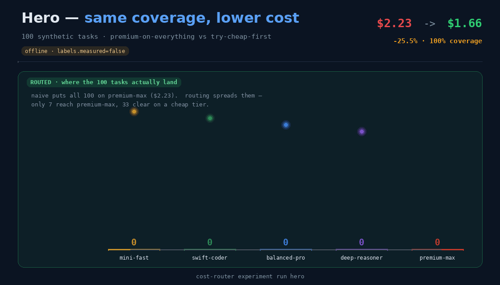

# Foundry Cost-Aware Model Routing

[](https://github.com/hyeonsangjeon/foundry-cost-aware-model-routing/actions/workflows/ci.yml)
[](https://hyeonsangjeon.github.io/foundry-cost-aware-model-routing/)
[](https://github.com/hyeonsangjeon/foundry-cost-aware-model-routing/actions/workflows/release-smoke.yml)
[](pyproject.toml)
[](LICENSE)

**Try the cheapest model first. Check the result, and call a stronger model only
after a failure.** Before extra calls run, the budget check decides whether to allow
them. Every decision is recorded in a hash-chained ledger that can recalculate cost
from the saved usage and rate card.

**Start here — pick one.**

- **Run it free, offline** — `python3 scripts/quickstart.py` builds a managed
  `.venv`, reproduces the offline projection (`measured=false`), and opens the
  dashboard on the port it actually binds. No account, no Azure call, nothing
  billed.
- **See it in a browser** — the
  [interactive demo](https://hyeonsangjeon.github.io/foundry-cost-aware-model-routing/demo/)
  ([한국어](https://hyeonsangjeon.github.io/foundry-cost-aware-model-routing/ko/demo/))
  is a read-only replay of an already-measured run, with nothing to install.
- **Read the measured results** — the
  [routing-mode dashboard · 03D](https://hyeonsangjeon.github.io/foundry-cost-aware-model-routing/manual/03d-results/)
  covers four arms over 24 coding tasks at n=3 against a live Azure AI Foundry
  deployment, scored against predictions registered before the run and sealed
  into a replay-verified snapshot.



<sub>Generated deterministically from this repository's own verified numbers by
[`scripts/build_experiment_gifs.py`](scripts/build_experiment_gifs.py). Offline
projection over synthetic data — `labels.measured=false`. Reproduce with
`cost-router experiment run hero`.</sub>

> **Strongest evidence — a five-prompt wiring proof (experiment 09).** Wired to a
> live Azure AI Foundry **Model Router** deployment over keyless Entra, one call
> really split to `gpt-5.4` (×3) and `grok-4-1-fast-reasoning` (×2) — this repo's
> first `measured=true` run, sealed into a hash-chained, replayable ledger.
> **Read it as a wiring proof, not a benchmark:** five prompts is far below the
> ≥100-prompt bar Microsoft gives for statistically reliable results (fewer than
> 30 prompts is directional only), and the run measures routing, usage, latency,
> auth and replay integrity — not savings.
> [Experiment 09 →](https://hyeonsangjeon.github.io/foundry-cost-aware-model-routing/lab-notebook/09-live-routing-proof/)

### Try it offline — free, no account, no Azure call

```bash
git clone https://github.com/hyeonsangjeon/foundry-cost-aware-model-routing.git
cd foundry-cost-aware-model-routing
python3 -m venv .venv && source .venv/bin/activate
pip install -e .          # core dep: pyyaml
cost-router hero          # before/after + reproducibility self-check
```

**Prefer one command?** `python3 scripts/quickstart.py` runs the four steps
above in a managed `.venv`, reproduces the result, and opens the dashboard on
the port it *actually* binds (it never assumes 8000). Add `--ci` for a headless
check that verifies the PASS and the accessible Star call-to-action, prints a
machine-readable ready line, and tears the server down after itself. Still 0
Azure — only a fresh live call is ever labelled `measured`.

**After install, the first result lands in well under a second** — the
`cost-router hero --json` segment was observed at **0.12 s** on both supported
interpreters (CPython 3.11.15 / 3.12.13); a fresh clone plus install added
roughly **6–9 s** on the same machine. Environment metadata and the full segment
table → [install guide](docs/ko/manual/install.md).

Both interpreters are held to that claim by CI: each run installs the package
**non-editable** (`pip install .`) on 3.11 and on 3.12, then runs `cost-router`
from a directory outside the checkout — so anything the package forgot to ship
fails the build here instead of failing your clone. Linux runners only, and
nothing is published to PyPI; `git clone` is still the install path.

### Where to go next

- **Methodology** — [measurement protocol](docs/ko/manual/measurement-protocol.md)
  (what may be called `measured`, sample-size tiers, snapshot/replay contract)
  and [core concepts](docs/ko/manual/concept.md).
- **Benchmark evidence** — the [ten experiments](#the-experiment-arc--honest-by-construction)
  below, and the [experiment atlas](docs/ko/manual/experiment-atlas.md) for how each
  one is built. The paid routing-mode track continues past that table:
  [experiment 13 · rate-card gap](https://hyeonsangjeon.github.io/foundry-cost-aware-model-routing/lab-notebook/13-router-modes-rate-card-gap/)
  is the run that found a hole in this repo's *own* rate card, withheld the affected
  arm's cost claim fail-closed, and pinned why that run's summary savings figure is
  not the site's published one.
- **Full manual (한국어)** —
  <https://hyeonsangjeon.github.io/foundry-cost-aware-model-routing/>
- **Interactive offline demo** (no install, no account, nothing is billed) —
  <https://hyeonsangjeon.github.io/foundry-cost-aware-model-routing/demo/?run=1>
  — animated before/after, five cost-and-coverage strategies, and the coverage loss
  after removing fallback models, all rendered from the same offline projection.

---

Two honesty rules run through everything: offline runs are **projections over
synthetic data** (`labels.measured=false`), and only a **fresh live call** is
ever labeled `measured=true`. The repo is intentionally small — source, tests,
placeholder configuration, and synthetic samples only; private notes and
diagrams stay outside Git.

> **Complementary to the built-in Model Router, not a replacement.** Azure AI
> Foundry's **Model Router** already picks a model per prompt — one deployment,
> cross-provider (OpenAI + Grok + DeepSeek + Llama + gpt-oss with no separate
> deploy; Claude the sole exception), and it works. *Model selection is solved.*
> This asset is the **layer on top**: it **verifies** the selected result against
> execution signals (accept only when clean), **escalates** on failure, **governs**
> multi-model spend before it happens, and makes every decision **auditable**
> (hash-chained, cost-replayable ledger). It even folds the built-in router in as
> a first-class candidate arm — an asset that *leverages* the product rather than
> competing with it.

## Requirements

- **Python 3.11 or 3.12** — the router uses `StrEnum`, so 3.10 fails to import.
  Check first with `python3 --version`. Newer interpreters are not claimed
  because they are not run in CI, so `pip` declines them at install time rather
  than letting an untested version fail later.
- `git`, plus network access for a one-time install (the only core dependency
  is `pyyaml`).

## Offline preview in depth

`cost-router hero` runs the flagship experiment as a **deterministic offline
projection over synthetic data** (`labels.measured=false`) — a *preview*, not a
measurement. It prints a before/after, a spotlight task, and a reproducibility
self-check (it exits non-zero if the projection ever drifts below the contracted
floor):

```bash
cost-router hero
cost-router hero --serve --port 8000   # dashboard; auto-falls back if the port is busy
```

## Make it real — your own Foundry deployments

> **Status: target / in progress.** The existing-Foundry journey below works
> today, but its end-to-end release gate is not yet in place, so treat the
> timings as a target rather than a promise. The offline path above is the
> guaranteed one.

The preview above is synthetic. To route against **your** deployed Azure AI
Foundry models, register them in a fleet config, pick which one plays each arm
(router/cheapest/premium/ensemble), and run the live arena — real calls → real
token usage → `measured=true`:

```bash
cost-router models list        # your deployed-model catalog + current slate
cost-router models select --premium gpt-5.4 --ensemble gpt-5.4-nano,gpt-5.4-mini,gpt-5.4
cost-router foundry arena --fleet .foundry-fleet.local.yaml --live
```

To install the credentialed extra and print these next steps in order, run
`python3 scripts/quickstart.py --foundry` (it installs `.[foundry]` and then
hands off — it makes no Azure call itself; you run `doctor` and the smoke when
you're ready).

See [**Fleet — register & select your models**](#fleet--register--select-your-models)
below for the config format, the terminal `/model` picker, dashboard selection,
and a single-deployment smoke test. Only a fresh live call is ever labeled
`measured=true`; everything offline stays an honest projection.

Prefer a **browser, one-button** flow instead of the CLI? `cost-router dashboard
--live` serves the *same* dashboard bound to `127.0.0.1` with a session token —
**no credential ever touches the browser** (Entra is read from `az login`):

```bash
az login                      # keyless Entra — no credential field in the browser
cost-router dashboard --live  # 127.0.0.1 + random port + a session-token URL
```

Connection check → the exact prompts + dry-run cost → **approve & run** (the human
gate) → live progress → snapshot replay — then seal and re-verify the spend with
`cost-router ledger measured-replay`. This is the clone → `.env` → one-button path;
the public page linked above is an **interactive offline demo** — a read-only
replay of an already-measured run, not a live paid dashboard. Full recipe: the
[cockpit & customization guide](docs/ko/manual/customize.md) and the
[end-to-end Foundry setup](docs/ko/manual/foundry-setup.md).

## The experiment arc — honest by construction

Ten one-command experiments test when cost-aware routing lowers cost and when it
does not. Experiments 01–08 are deterministic offline projections over synthetic
data (`labels.measured=false`); 09–10 are real **measured** runs against a live
Foundry Model Router:

| # | Experiment | Question it answers | Result |
| --- | --- | --- | --- |
| 01 | [Hero](https://hyeonsangjeon.github.io/foundry-cost-aware-model-routing/lab-notebook/01-hero/) | Routing on a realistic 100-task workload? | 100% coverage, **−25.5%** cost |
| 02 | [Curated](https://hyeonsangjeon.github.io/foundry-cost-aware-model-routing/lab-notebook/02-curated/) | Five tasks you can follow by eye? | 100% coverage, **−56.7%** cost |
| 03 | [Coverage cliff](https://hyeonsangjeon.github.io/foundry-cost-aware-model-routing/lab-notebook/03-coverage-cliff/) | Delete the expensive fallback to save more? | cost falls, but coverage drops **100% → 67%** |
| 04 | [No free lunch](https://hyeonsangjeon.github.io/foundry-cost-aware-model-routing/lab-notebook/04-no-free-lunch/) | A workload where only the top model passes? | 100% coverage, **0%** saved |
| 05 | [Ensemble fan-out tax](https://hyeonsangjeon.github.io/foundry-cost-aware-model-routing/lab-notebook/05-ensemble-fanout/) | What does "just ensemble every model" really cost? | 100% coverage, **−47%** — all candidate calls cost **3.74×** the winner |
| 06 | [Adaptive fan-out dial](https://hyeonsangjeon.github.io/foundry-cost-aware-model-routing/lab-notebook/06-fanout-dial/) | Can you keep the savings but drop the extra calls? | compared with experiment 05, one budget threshold keeps coverage/savings unchanged while the extra-call ratio falls **3.74× → $0** |
| 07 | [Routing layer](https://hyeonsangjeon.github.io/foundry-cost-aware-model-routing/lab-notebook/07-model-router/) | Single-call routing — pick once, no escalation (the shape any per-prompt router has, including ours in ordered-only mode)? | 52% coverage; layering observe-then-escalate on top reaches 100% at ~the same cost (gain **+48%p**) — experiment 09 wires a real deployment in as this arm |
| 08 | [Arena](https://hyeonsangjeon.github.io/foundry-cost-aware-model-routing/lab-notebook/08-arena/) *(one-task comparison)* | One problem, four ways — what does each cost, how long does it take, and does it pass? | router is the **cheapest correct** answer but the **slowest** (sequential escalation); latency is a **new illustrative projection** |
| 09 | [Live routing proof](https://hyeonsangjeon.github.io/foundry-cost-aware-model-routing/lab-notebook/09-live-routing-proof/) *(measured)* | Wired to a real Foundry Model Router, what does it actually pick? | one `model-router` deployment really split to **`gpt-5.4` (×3) and `grok-4-1-fast-reasoning` (×2)** — the repo's **first `measured = true`** run, keyless Entra |
| 10 | [Measured ledger](https://hyeonsangjeon.github.io/foundry-cost-aware-model-routing/lab-notebook/10-measured-ledger/) *(measured)* | Once it's measured, can anyone re-verify the record wasn't tampered with? | the live run is sealed into a **hash-chained, cost-replayable** ledger — `measured-replay` re-derives every amount from token usage × a pinned rate card; **one edited byte fails it**, the offline ledger stays untouched. Integrity, not a cost claim: the router arm's amounts are **pricing-incomplete** and carry a versioned annotation that every renderer enforces |

Experiments 01–02 show lower cost; 03–07 test ways that result can fail or cost
more; 08 compares four approaches on one task and adds illustrative latency. Each
`expect` contract fails CI if the projection drifts, including a ceiling that rejects
an implausibly large saving and a floor that requires escalation to recover coverage.
Read them in order in the
[**story arc**](https://hyeonsangjeon.github.io/foundry-cost-aware-model-routing/lab-notebook/story-arc/)
([EN summary](https://hyeonsangjeon.github.io/foundry-cost-aware-model-routing/lab-notebook/story-arc-en/)),
or dive into the full
[Korean lab notebook](https://hyeonsangjeon.github.io/foundry-cost-aware-model-routing/lab-notebook/).

## Bring your own deployments

This repo attaches to Foundry deployments you **already have**; it provisions
nothing. To add an arm, put its **deployment name** in a fleet YAML
(`samples/fleet/*.yaml`) — that is the whole bring-your-own-route step. The
built-in **Model Router** arm needs no extra deployment: a single `model-router`
deployment already routes cross-provider (OpenAI · xAI · DeepSeek · Meta)
internally. This repo then checks the selected result, retries after failure, limits
spending, and records the decision instead of re-deploying those models.

## Usage

Install with dev tools (ruff, pytest) when you want to run the suite:

```bash
make dev            # or: pip install -e ".[dev]"
```

Replay routing over the sample workload and summarize cost vs. baseline:

```bash
cost-router replay              # curated sample fixture
cost-router replay --synth      # deterministic signals for the whole workload
cost-router route-once --task-id t-0003
cost-router evals --synth       # routed vs. always-most-expensive baseline
```

### Experiments

A named experiment is a small YAML (`experiments/*.yaml`) that pins a workload,
its offline signals, pricing, and policy, plus an `expect` reproducibility
contract. See [`experiments/`](experiments/) and the
[Korean manual](https://hyeonsangjeon.github.io/foundry-cost-aware-model-routing/manual/experiments/).

```bash
cost-router experiment list          # list available experiments
cost-router experiment run curated   # run one by name
cost-router experiment run hero --json
```

The hard-workload boundary: only the top model passes, so routing keeps full
coverage but saves **0%**. A two-sided `expect` contract fails CI if a future change
reports a saving here (lab notebook:
실험 04 · 공짜 점심은 없다):

```bash
cost-router experiment run limits    # coverage 100.0% · saved 0.0%
```

The honest counter-example — deleting the expensive fallback models looks
cheaper but drops coverage from 100% to 67% (lab notebook: 실험 03 · 커버리지 절벽):

```bash
cost-router policy regression --candidate experiments/policies/cost-cut.yaml --synth
```

All-candidate call cost: compare mode calls every candidate on high-value tasks but
stores only the winner in the routing bill. `src/router/metrics.py` also sums every
candidate call and records the difference for the web app and historical dashboard
(lab notebook: 실험 05 · 앙상블 팬아웃 세금):

```bash
cost-router experiment run ensemble          # 100% coverage, −47% — but fan-out is 3.74× the winner
cost-router metrics emit ensemble            # Azure Monitor / OTel metric records (offline, measured=false)
cost-router experiment run ensemble --metrics-store runs.jsonl
cost-router metrics history --store runs.jsonl
```

The `compare_min_value` threshold controls how many tasks call every candidate.
Raising it reduces fan-out tasks. Coverage (100%) and savings (47%) stay unchanged
while the extra-call ratio falls **3.74× → $0**. Experiment 06 pins this with a
`max_tax_ratio` ceiling (lab notebook: 실험 06 · 적응형 팬아웃 다이얼):

```bash
cost-router experiment run adaptive          # 100% coverage, −47% — fan-out tax dialed to 0.00×
```

The routing layer — single-call routing picks one model per prompt, up front,
with no escalation. That's the shape any per-prompt router has, including Azure
AI Foundry's built-in **Model Router** and this repo's own ordered-only mode.
Selection is the product's job; everything below is the layer on top of it. A
dependency-free, env-gated adapter (`FOUNDRY_*`) lets a live deployment's
decisions replace the offline proxy, and experiment 09 wires that real
deployment in as the arm and proves it `measured=true`.

Experiment 07 adds a generic **single-call** arm over synthetic tasks
(`measured=false`), not a product measurement. It reaches **52%** coverage; the
observe-then-escalate path reaches **100%** at about the same cost. The
`min_escalation_gain` contract pins the **+48%p** difference (lab notebook: 실험 07 ·
라우팅 레이어):

```bash
cost-router experiment run single-call       # 100% coverage, −25.5% — single-call vs escalate gain +48%p
```

The live measured bridge — turning that env-gated adapter into **measured
usage**. `cost-router foundry live` prices a Model Router run on the endpoint's
**real token usage** (not synthetic tokens): the recorded snapshot reports
`$0.02` (avg `$0.0041`/task) as **pricing-incomplete historical output**,
coverage ungraded — usage is measured; correctness needs a grader. Model
Router billing is composite (a router input-token markup **plus** the resolved
model's charges) and the pinned rate card declares no markup, so every routed
amount omits one billed component. The CLI marks those figures `†` and refuses
to publish a router savings claim; if the versioned annotation
([`samples/annotations/legacy-router-pricing.annotation.json`](samples/annotations/legacy-router-pricing.annotation.json))
is missing or its hashes drift, every renderer, publisher and replay **fails
closed**. Direct-model arms are never charged the markup and are unaffected.
`measured=true` is reserved for a genuine
live call; without credentials it replays a recorded snapshot so the path stays
offline/deterministic. Secrets are never printed — `foundry status` masks them
(manual: 라이브 실측 브릿지):

```bash
cost-router foundry status                   # redacted config + live-call readiness
cost-router foundry live                      # recorded snapshot (offline, measured=false)
cost-router foundry live --store runs.jsonl   # record into the historical dashboard
cost-router foundry live --live --workload my-prompts.jsonl \
  --pricing samples/pricing/your-tenant.yaml  # real Azure calls → measured=true
```

### The 30-second before / after

`make replay-all` (and `cost-router replay --synth`) end with a naive-vs-routed
block: the naive column bills the most expensive candidate for every task, the
routed column is cost-aware routing (cheapest candidate that passes its own
checks, escalate only on failure). Over the full 100-row synthetic workload:

```bash
cost-router replay --workload samples/telemetry/mixed-coding-workload.sample.jsonl --synth
```

```text
before / after  (offline projection over synthetic data; labels.measured=false)
  BEFORE  naive: premium model on every task   $2.23
  AFTER   cost-aware routing                   $1.66
  SAVED   $0.57  (25.5% lower)  at 100.0% coverage
  strategy  single-route=74 ensemble=26  |  clean-first=19 compared=18 escalated=55 tie-broken=8
```

These numbers are an **offline projection over synthetic data**, not a measured
result — every trace carries `labels.measured=false`. Real savings depend on
your own workload mix and rates. All model names are generic placeholders.

The same flows are available without installing, via `make` or `python -m router`:

```bash
make replay        make replay-all      # full workload (deterministic synth signals)
make evals         make evals-all
make check         make test            # validation gate / pytest
```

With `--synth`, offline check signals are derived deterministically from each
task's class, difficulty, and policy priors, so the full workload replays
identically every time. All model names are generic placeholders.

## Audit ledger & single-call baselines

Record every decision from a replay (or one task) to an append-only JSONL ledger,
then re-run the stored selection inputs and verify the canonical final payload:

```bash
cost-router replay --synth --ledger reports/routing.local.jsonl
cost-router ledger replay --ledger reports/routing.local.jsonl
```

The ledger stores policy/pricing hashes, normalized task risk/difficulty,
candidate order and signals, the gate decision, chosen model/cost, and honest
offline labels. Verification passes only when all stored decisions reproduce
byte-for-byte and required-field completeness is at least 99%.

The current router selects one execution from **precomputed offline signals**;
those signal inspections are not model calls. Ledger cost therefore uses the
explicit `selected-execution-only` billing basis. A future live fan-out layer
must account for every panel/judge call separately.

Replay/eval summaries also expose three transparent **illustrative equivalents**
for single-call comparisons: `cost` picks each class's cheapest candidate,
`balanced` its middle candidate, and `quality` its most expensive candidate.
They are deterministic placeholder baselines, not claims about a managed
router's internal implementation.

## Fleet — register & select your models

The live head-to-head (`cost-router foundry arena`) and the dashboard build
their four strategy arms from a **fleet config**: which *deployed* Azure AI
Foundry model plays each role — the **router (main)**, the **cheapest** floor,
the **premium** ceiling, and the **ensemble** fan-out. This is the "register
your models" step, and it lives in a small YAML you own:

```yaml
# samples/fleet/foundry-5series.fleet.yaml
models:
  - { name: gpt-5.4-nano, deployment: gpt-5.4-nano, tier: small }
  - { name: gpt-5.4,      deployment: gpt-5.4,      tier: frontier }
  - { name: model-router, deployment: model-router, tier: router }
roles:
  router: model-router
  cheapest: gpt-5.4-nano
  premium: gpt-5.4
  ensemble: [gpt-5.4-nano, gpt-5.4-mini, gpt-5.4]
```

`name` is the logical/pricing key; `deployment` is the Azure deployment name the
live client calls (decoupled on purpose). Point any run at your file with
`--fleet PATH` or `FOUNDRY_FLEET_PATH`; with neither, the bundled sample (then a
safe in-code default) is used.

**Select from the terminal** — inspect the catalog, then pick each arm (an
interactive `/model` picker, or non-interactive flags). The choice is saved to a
gitignored `.foundry-fleet.local.yaml`:

```bash
cost-router models list          # catalog + current slate + live readiness
cost-router models select        # interactive: enter a number or name per arm
cost-router models select --premium gpt-5.4 --ensemble gpt-5.4-nano,gpt-5.4-mini,gpt-5.4
cost-router foundry arena --fleet .foundry-fleet.local.yaml --live   # measure YOUR slate
```

**Select from the dashboard** — the "Fleet & live routing" panel lists the same
catalog with dropdowns for router/cheapest/premium and ensemble checkboxes.
"Run selection" replays the committed measured snapshot (honestly relabeled
`measured = false`, `provenance = recorded` — the web path never makes paid
calls) and prints the exact terminal command to measure your selection live.

> **Only one deployment?** Copy `samples/fleet/single-deployment.example.yaml`,
> point every arm at your one model, and you can still prove the whole live path
> end-to-end (keyless Entra → real call → token usage → priced → hash-chained
> ledger). Every arm ties — that is the point of a single-deployment smoke.

## Service

The same routing pipeline is available as a small offline HTTP service built on
the Python standard library (no web framework, no provider calls):

```bash
cost-router serve --host 127.0.0.1 --port 8000   # or: make serve
```

If the port is already in use, the server falls back to the next free port and
prints the actual URL instead of crashing.

Endpoints (all JSON, all deterministic and network-free):

| Method | Path           | Purpose                                                  |
| ------ | -------------- | -------------------------------------------------------- |
| GET    | `/healthz`     | Liveness probe.                                          |
| GET    | `/policy`      | Policy version and ordered candidates per task class.    |
| GET    | `/fleet`       | Model catalog, current slate, and live readiness.        |
| POST   | `/fleet/run`   | Validate a selected slate; replay the recorded arena.    |
| POST   | `/route`       | Route one task payload, return its routing trace.        |
| POST   | `/batch-route` | Route many task payloads, return traces plus a summary.  |

Route a single task (synthesizing offline check signals when none are supplied):

```bash
curl -s http://127.0.0.1:8000/route \
  -H 'content-type: application/json' \
  -d '{"task": {"task_id": "t-0001", "class": "generate",
                "tokens": {"input": 1232, "cached": 448, "output": 418, "reasoning": 168}},
       "synth": true}'
```

`pricing` accepts `"illustrative"` (default, bundled sample rates) or `"none"`
to omit cost estimates. Provide `signals` per model to override the synthesized
offline checks. `/batch-route` takes a `tasks` array and returns the same
aggregate summary as `cost-router evals`.

### Container

A public-safe image runs the offline service with no secrets or local notes in
its build context:

```bash
make docker-build          # docker build -t cost-router:local .
make docker-run            # serves on http://127.0.0.1:8000
```

## Policy ops & regression guard

Inspect, validate, diff, and simulate routing policies — and check cost/coverage
regressions before changing one:

```bash
cost-router policy show
cost-router policy validate --policy src/policy/seed_policy.yaml
cost-router policy diff --candidate samples/policy/candidate.example.yaml
cost-router policy simulate --policy samples/policy/candidate.example.yaml --synth
cost-router policy regression --candidate samples/policy/candidate.example.yaml --synth
```

`replay`, `route-once`, `evals`, and `serve` all accept an optional `--policy PATH`.
Resolution precedence is **CLI `--policy` > `COST_ROUTER_POLICY` env var > bundled
seed**; the service binds whichever policy was chosen at startup (requests can't
pick a file).

The regression report scores the base and candidate policies on **one shared set
of evaluation signals** so the deltas isolate the routing change. With `--synth`
the signals are synthesized once from the *union* of both policies' candidates:
shared models keep the base policy's prior, and the most expensive model in the
union is the guaranteed clean fallback. Raising a candidate's `prior_pass` alone
therefore leaves the signals untouched (zero delta), while dropping an expensive
fallback exposes the coverage risk it creates instead of hiding it. Over the
synthetic 100-row workload the bundled candidate (which removes the `premium-max`
fallback from `repo_patch`) routes for `$1.34` vs the seed's `$1.66`, but
coverage drops to `93%` (base `100%`). The report shows both the lower cost and lower
coverage. The result is deterministic for a given workload, and all models
stay generic placeholders.

---

**Used this somewhere real?** If you ran it in a customer meeting, a workshop, or a
reproduction against your own tenant, please
[file a field-use report](https://github.com/hyeonsangjeon/foundry-cost-aware-model-routing/issues/new?template=field-use.md)
— especially if it did not fit. Clone counts cannot tell a person from a CI job, so
a two-line note about where this actually landed is worth more than the metrics are.
