# Experiment Atlas — how each experiment is built

> **English visual manual.** The dashboard's **Experiments — click for the metrics** strip has six
> tabs — `adaptive`, `curated`, `ensemble`, `hero`, `limits`, `model-router`. Each one re-runs the
> *same* router over a workload and prints cost · coverage · fan-out tax under a reproducibility
> contract. This page opens the hood: **which models** each uses, **what it processes**, **which
> selection mechanism** (ordered escalation, fan-out, or single-call), and the **honest headline**.
> It ends with a complete **Azure follow-along** so you can stand the real thing up yourself.

!!! tip "The diagrams animate"
    The mechanism and architecture SVGs below are animated (they loop in your browser like a GIF) —
    watch the router walk the ladder, fan out, and pick a backend. Every number is an **offline
    deterministic projection** (`labels.measured=false`) *except* the live Foundry bridge in the
    final section, which is `measured=true`.

## At a glance

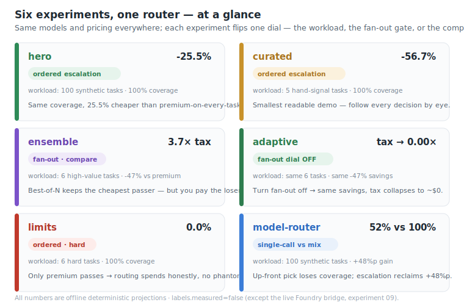

Same models, same pricing, same policy everywhere. Each experiment flips exactly **one dial** — the
workload, the fan-out gate, or the comparison arm — so you can read one idea at a time.

---

## The shared machinery

### 1 · The model ladder

Every experiment draws from one universe of candidate models. The routing **policy**
([`src/policy/seed_policy.yaml`](https://github.com/hyeonsangjeon/foundry-cost-aware-model-routing/blob/main/src/policy/seed_policy.yaml))
maps each **task class** to an *ordered* list of candidates, cheapest first, each carrying two
priors: a **pass-rate** and a **`$/resolved`** (total dollars per resolved task).

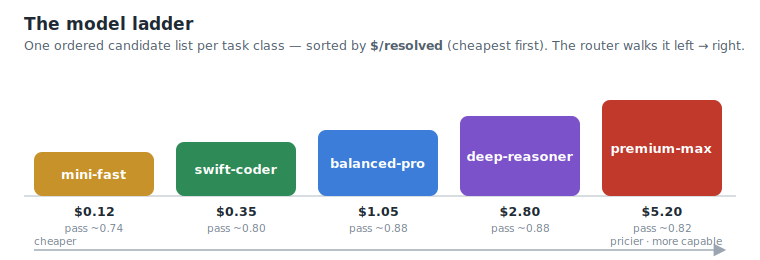

| Task class | Ordered candidates (cheapest → priciest, `$/resolved`) |
| --- | --- |
| `plan` | swift-coder `0.40` · balanced-pro `1.10` · deep-reasoner `2.80` |
| `generate` | mini-fast `0.12` · swift-coder `0.35` · balanced-pro `1.05` |
| `test` | mini-fast `0.15` · swift-coder `0.38` · balanced-pro `1.00` |
| `validate` | mini-fast `0.14` · balanced-pro `0.95` · deep-reasoner `2.50` |
| `repo_patch` | swift-coder `0.55` · balanced-pro `1.40` · deep-reasoner `3.10` · premium-max `5.20` |

!!! note "The model names are generic stand-ins"
    `mini-fast … premium-max` are illustrative placeholders, not vendor products, and the priors are
    seeded (not measured). You replace them with values derived from your own routing telemetry. The
    **live** section at the bottom shows the real models the Azure Model Router actually selected
    (`gpt-5.4`, `grok-4-1-fast-reasoning`).

### 2 · Four decision layers

Under the hood, one task flows through four layers (detailed in [Core concepts](concept.md)):

```text
1. CLASSIFY  task → {plan, generate, test, validate, repo_patch}
2. POLICY    task class → ordered candidate models (pass-rate, $/resolved priors)
3. SELECT    cost-aware single route (cheapest-clean-first); escalate/fan-out on failure
4. GOVERN    a cost governor decides — before spending — whether a task is worth fanning out
```

Only **layer 3 (SELECT)** changes shape between experiments. There are exactly **three shapes**.

### 3 · The three selection mechanisms

=== "Ordered escalation"

    Walk candidates cheap → pricey. Accept the **first clean result** (self-verifiable signals:
    *applies · compiles · tests pass · lint/type pass*). Escalate **only** on a failed check. You are
    billed for the **accepted** model — the failed cheap attempts are observed, not charged as
    winners. This is where most of the savings come from.

    

    *Used by · `hero` · `curated` · `limits` · `adaptive`*  ·  code: `ordered_select()`

=== "Fan-out (ensemble)"

    Run **every** candidate in parallel (`compare` mode), score each by its execution signals, and
    keep the highest — ties break to the **cheapest passing** model. Coverage is high, but you pay to
    run the losers too: **the ensemble tax**.

    

    *Used by · `ensemble`*  ·  code: `compare_select()`

=== "Single-call"

    Bucket each prompt by predicted difficulty and commit to **one** model up front — no fan-out, no
    escalation. It cannot correct a wrong up-front pick, so coverage drops. This is the *shape* of a
    productized router; the real one's pick-skill is proprietary and **measured** (see the last
    section).

    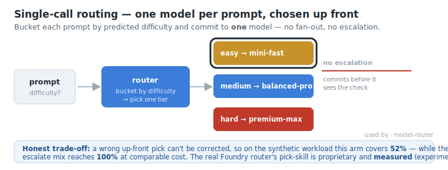

    *Used by · `model-router`*  ·  code: `model_router_pick()`

---

## The six experiments

Every card lists **what it processes**, **which models**, **which mechanism**, the **dial** it turns,
the **headline** (re-derived live by the command shown), and a link to the full lab-notebook entry.

Each card **opens with a looping animation** that traces its real mechanism — flow dots, the
escalation ladder, or the fan-out — while the offline (`measured=false`) numbers count up live.
They are generated deterministically from the numbers above by
[`scripts/build_experiment_gifs.py`](https://github.com/hyeonsangjeon/foundry-cost-aware-model-routing/blob/main/scripts/build_experiment_gifs.py)
(Pillow + ffmpeg).

### `hero` — same coverage, lower cost

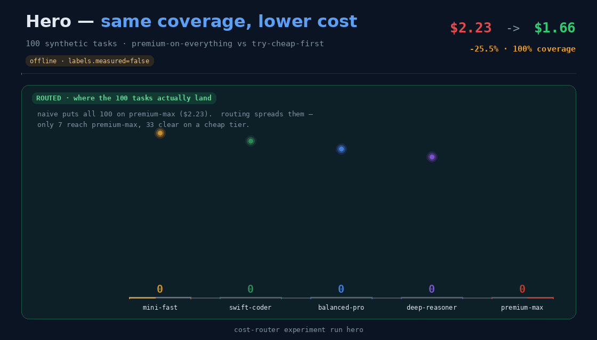

| | |
| --- | --- |
| **Processes** | 100 synthetic tasks (deterministic offline signals, `synth: true`) |
| **Models** | full ladder per class (mini-fast … premium-max) |
| **Mechanism** | **Ordered escalation** |
| **Dial** | none — the flagship default |
| **Headline** | **100% coverage · −25.5%** vs premium-on-every-task ($2.226910 → $1.659167) |
| **Contract** | `min_coverage 1.0`, `min_delta_pct 0.20`, `min_tasks 100` |

```bash
cost-router experiment run hero
```

The naive arm puts the *most expensive* candidate on every task (100% coverage, $2.23). Ordered
escalation keeps that 100% coverage but tries cheap-clean-first, landing 25.5% cheaper.
→ [Lab-notebook 01](../lab-notebook/01-hero.md)

### `curated` — five tasks you can read

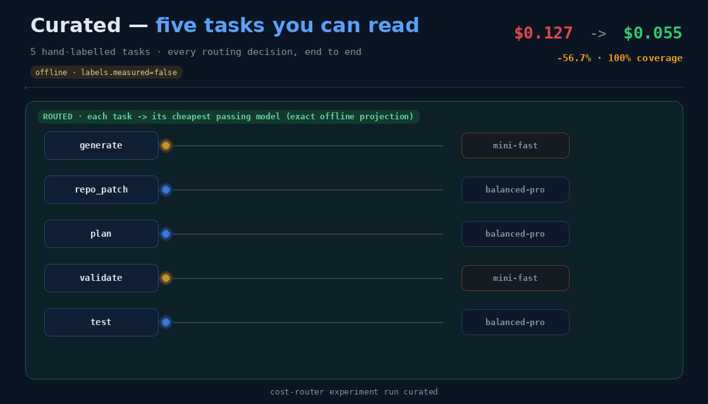

| | |
| --- | --- |
| **Processes** | 5 hand-written offline signals (`samples/responses/routing-signals.sample.json`) |
| **Models** | full ladder per class |
| **Mechanism** | **Ordered escalation** |
| **Dial** | none — smallest "does it work?" check |
| **Headline** | **100% coverage · −56.7%** ($0.127136 → $0.055038) |
| **Contract** | `min_coverage 1.0`, `min_delta_pct 0.30`, `min_tasks 3` |

```bash
cost-router experiment run curated
```

Tiny enough to follow every routing decision by eye end-to-end.
→ [Lab-notebook 02](../lab-notebook/02-curated.md)

### `ensemble` — best-of-N, at a real cost

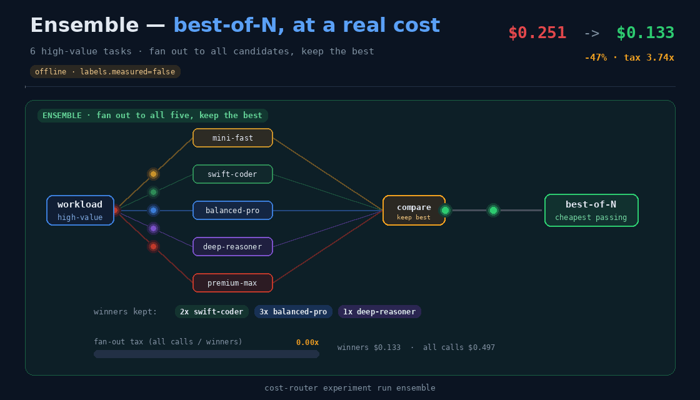

| | |
| --- | --- |
| **Processes** | 6 high-value tasks (`samples/responses/ensemble-fanout-signals.sample.json`) |
| **Models** | full ladder per class, **all** run per task |
| **Mechanism** | **Fan-out (compare)** |
| **Dial** | fan-out **on** for every task |
| **Headline** | **−47%** vs naive ($0.250728 → $0.132801) · but a **≈3.7× fan-out tax** (winners ≈ $0.13, all calls ≈ $0.50) |
| **Contract** | `min_coverage 1.0`, `min_delta_pct 0.40`, `min_tasks 6` |

```bash
cost-router experiment run ensemble
```

Because several models pass each high-value task, best-of-N settles on the **cheapest passing**
model — still 47% under naive — but fanning out means paying for the losing calls too.
→ [Lab-notebook 05](../lab-notebook/05-ensemble-fanout.md)

### `adaptive` — the fan-out dial, turned off

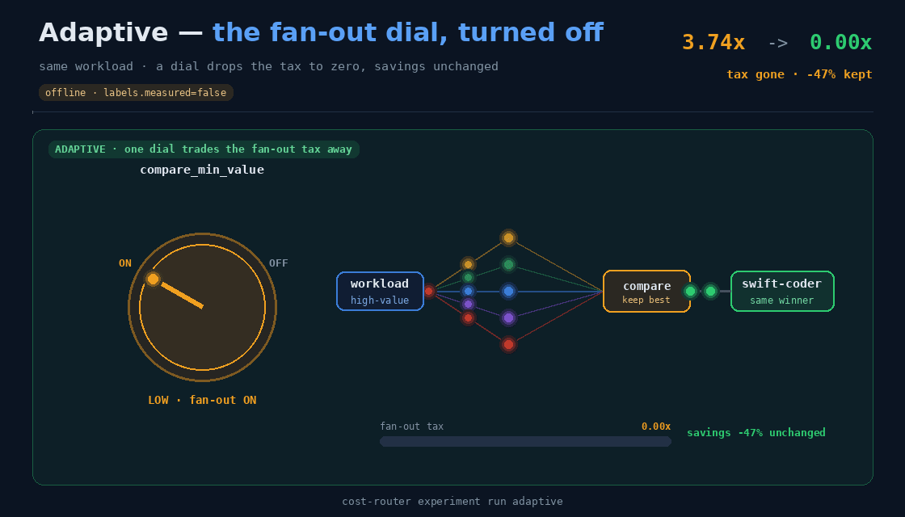

| | |
| --- | --- |
| **Processes** | the **same** 6 high-value tasks as `ensemble` |
| **Models** | full ladder per class |
| **Mechanism** | **Ordered escalation** (fan-out gated off) |
| **Dial** | `budget.compare_min_value: 1.1` — above every task's value (max 1.0) → **never fans out** |
| **Headline** | **identical −47% at 100% coverage**, but **fan-out tax → 0.00×** |
| **Contract** | `min_coverage 1.0`, `min_delta_pct 0.40`, `max_tax_ratio 0.01`, `min_tasks 6` |

```bash
cost-router experiment run adaptive
```

Same workload, same savings, same coverage as `ensemble` — but the ensemble tax collapses to ~$0.
On this deterministic projection, single-route escalation already reaches the same cheapest-passing
winner fan-out finds, so the tax is pure. (In a real system best-of-N can lift *quality* — measure
that before paying the tax.)
→ [Lab-notebook 06](../lab-notebook/06-fanout-dial.md)

### `limits` — there is no free lunch

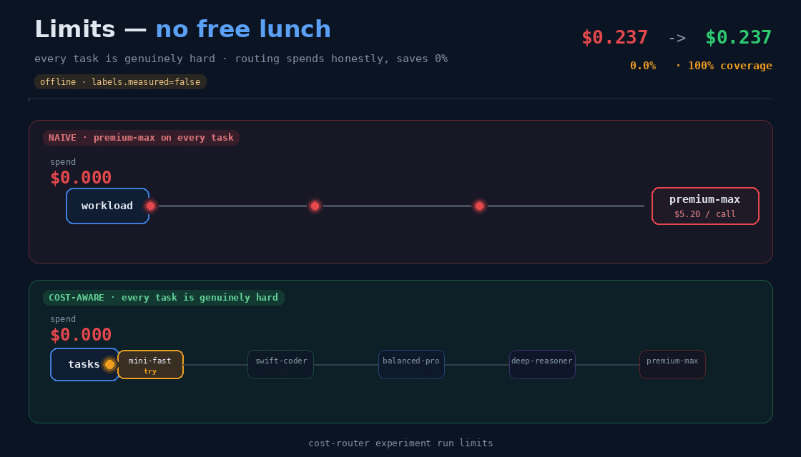

| | |
| --- | --- |
| **Processes** | 6 genuinely hard tasks where **only the priciest candidate passes** (`hard-tasks-signals.sample.json`) |
| **Models** | full ladder per class |
| **Mechanism** | **Ordered escalation** (climbs to the top every time) |
| **Dial** | none |
| **Headline** | **0.0% savings at 100% coverage** — routing == naive here |
| **Contract** | two-sided: `min_coverage 1.0`, `min_delta_pct 0.0`, **`max_delta_pct 0.0`** |

```bash
cost-router experiment run limits
```

The deliberate counter-weight to `hero`. Routing tries the cheap models, watches them fail, and
correctly escalates to the top model on every task. It does not invent savings — and the
**`max_delta_pct 0.0`** ceiling makes CI fail loudly if a future change ever fakes a "cheaper" number
on hard work.
→ [Lab-notebook 04](../lab-notebook/04-no-free-lunch.md)

### `model-router` — one pick vs observe-and-escalate

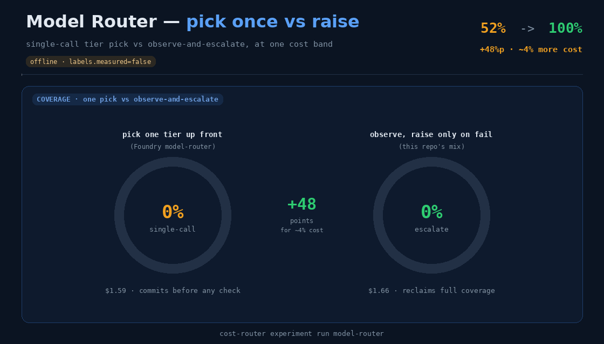

| | |
| --- | --- |
| **Processes** | 100 synthetic tasks |
| **Models** | full ladder per class |
| **Mechanism** | **Single-call** arm compared against the escalating **mix** |
| **Dial** | surfaces a `model_router` strategy arm alongside the mix |
| **Headline** | single-call **52%** coverage vs mix **100%** — an **escalation gain of +48%p** at comparable cost |
| **Contract** | `min_coverage 1.0`, `min_delta_pct 0.20`, `min_tasks 100`, **`min_escalation_gain 0.30`** |

```bash
cost-router experiment run model-router
```

A single-call router commits before it sees any check, so a wrong pick can't be corrected and
coverage drops to 52%. The observe-then-escalate mix reclaims full coverage for nearly the same
cost. The real Foundry Model Router's pick-skill is proprietary — that gap is exactly what the
**measured** live bridge captures next.
→ [Lab-notebook 07](../lab-notebook/07-model-router.md)

---

## The cost × coverage frontier

Put the single-call arms next to the routing strategies and the trade-off is visible at a glance
(this is the dashboard's frontier scatter):

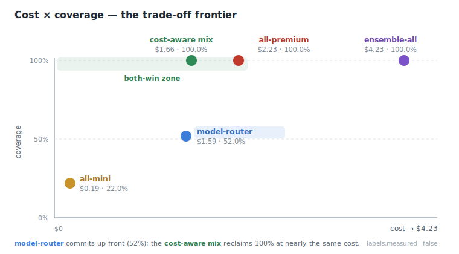

| Strategy | Selection | Cost | Coverage |
| --- | --- | ---: | ---: |
| `all-mini` | cheapest candidate on every task | **$0.19** | 22.0% |
| `model-router` | single difficulty-tiered pick | $1.59 | 52.0% |
| **`cost-aware mix`** | **cheapest-clean-first, escalate on fail** | **$1.66** | **100.0%** |
| `all-premium` (naive) | priciest candidate on every task | $2.23 | 100.0% |
| `ensemble-all` | fan out to every model, every task | $4.23 | 100.0% |

The **cost-aware mix** sits in the *both-win zone*: 100% coverage at roughly the cheapest cost that
still buys full coverage — well under `all-premium`, and a fraction of `ensemble-all`.

---

## From offline projection to measured routing (Azure setup)

Everything above is an **offline projection**. To turn *model selection* into a real **measured**
result, deploy an Azure AI Foundry **Model Router** and let it route real prompts. You call **one**
deployment (`model="model-router"`); the router picks a backend **from its own managed roster** and
returns which one in `response.model`.

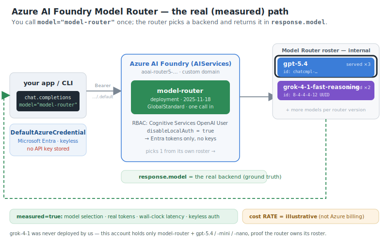

!!! success "This is exactly how experiment 09 was proven"
    Through this one `model-router` deployment, curated prompts split live to **`gpt-5.4` (×3)** and
    **`grok-4-1-fast-reasoning` (×2)** — with distinct response-id fingerprints (`gpt-5.4` →
    `chatcmpl-…`, grok → a pure UUID) as backend provenance. Notably, **grok was never deployed by
    us** — the account holds only `model-router` + `gpt-5.4 / -mini / -nano`, proving the router
    routes to *its own* roster. Full evidence: [Lab-notebook 09 · live routing proof](../lab-notebook/09-live-routing-proof.md).

### Follow along — keyless (Microsoft Entra) end to end

Uses **Microsoft Entra ID only** (no API keys are ever created or stored). Replace the `<PLACEHOLDERS>`.
We used region **`eastus2`** (it carries the full GPT-5 lineup + `model-router`).

```bash
# 0) Sign in and pin the subscription (device code for headless/sandbox shells)
az login --tenant <TENANT_ID> --use-device-code
az account set --subscription <SUBSCRIPTION_ID>

# 1) A dedicated resource group
az group create --name <RG> --location eastus2

# 2) An Azure AI Foundry (AIServices) account with a custom domain
az cognitiveservices account create \
  --name <ACCOUNT> --resource-group <RG> \
  --kind AIServices --sku S0 --location eastus2 \
  --custom-domain <ACCOUNT> --yes

# 2b) Turn OFF local (key) auth — Entra tokens only, no keys anywhere
az resource update \
  --ids "$(az cognitiveservices account show -n <ACCOUNT> -g <RG> --query id -o tsv)" \
  --set properties.disableLocalAuth=true

# 3) Grant YOUR identity the data-plane role (inference needs this exact role,
#    not Contributor). Once per resource.
az role assignment create \
  --assignee "$(az ad signed-in-user show --query id -o tsv)" \
  --role "Cognitive Services OpenAI User" \
  --scope "$(az cognitiveservices account show -n <ACCOUNT> -g <RG> --query id -o tsv)"

# 4) Deploy the Model Router (one call in → router picks the backend)
az cognitiveservices account deployment create \
  -n <ACCOUNT> -g <RG> \
  --deployment-name model-router \
  --model-name model-router --model-version 2025-11-18 \
  --model-format OpenAI \
  --sku-name GlobalStandard --sku-capacity 10

# 4b) (Optional) Deploy the GPT-5.4 family for direct calls / your own ladder.
#     The router does NOT need these — it owns its roster — but they are handy
#     for side-by-side direct comparisons.
for spec in "gpt-5.4:2026-03-05" "gpt-5.4-mini:2026-03-17" "gpt-5.4-nano:2026-03-17"; do
  az cognitiveservices account deployment create \
    -n <ACCOUNT> -g <RG> \
    --deployment-name "${spec%%:*}" \
    --model-name "${spec%%:*}" --model-version "${spec##*:}" \
    --model-format OpenAI \
    --sku-name GlobalStandard --sku-capacity 10
done
```

!!! tip "Check what your region actually offers"
    Model names, versions, and `model-router` availability vary by region. List them first and adjust
    the versions above:
    ```bash
    az cognitiveservices account list-models -n <ACCOUNT> -g <RG> \
      --query "[?contains(name,'router') || starts_with(name,'gpt-5')].{name:name, version:version, format:format}" -o table
    ```

### Wire the repo to it

Copy `.env.sample` → `.env` (gitignored) and set **only** the endpoint + deployment; leave the API
key empty so the bridge auto-selects Entra:

```bash
AZURE_AI_FOUNDRY_ENDPOINT=https://<ACCOUNT>.cognitiveservices.azure.com/
AZURE_AI_FOUNDRY_MODEL_ROUTER=model-router
AZURE_AI_FOUNDRY_AUTH=entra        # optional — auto-selected when no key is present
```

Install the live extra, then verify the wiring **without exposing any secret**:

```bash
pip install "foundry-cost-router[foundry]"   # openai + azure-identity
cost-router foundry status
#   router configured : yes
#   credentialed      : yes
#   auth method       : Microsoft Entra ID (keyless)
```

### Run one measured routing pass

The bundled telemetry has no prompt text, so a curated prompt workload ships for live sending. With
credentials in place, this one command makes every curated task a real Model Router call
(`measured = true`):

```bash
cost-router foundry live --live \
  --workload samples/telemetry/curated-arena-live.sample.jsonl \
  --pricing  samples/pricing/your-tenant.yaml \
  --store    runs.jsonl
#   provenance : live
#   measured   : yes
```

No credentials yet? Replay the recorded snapshot to walk the exact same scoring path, deterministic
and offline (`measured = false`):

```bash
cost-router foundry live --workload samples/telemetry/curated-arena-live.sample.jsonl
```

The full bridge reference (env-var table, scoring path, honesty labels) lives in
[Live measured bridge](foundry-live.md).

---

## What is measured, and what is not

| Claim | Live bridge | Offline experiments |
| --- | --- | --- |
| **Model selection** (which backend) | ✅ measured — real `response.model` | projected |
| **Token usage** (billed input/output/reasoning) | ✅ measured — provider usage | synthetic |
| **Wall-clock latency** | ✅ measured | not modeled |
| **Keyless auth** | ✅ real Entra bearer token | n/a |
| **Accuracy / coverage** | ⚠️ projected unless you inject a `grader` (`coverage_measured=false`) | projected |
| **Cost *rate*** (USD per token) | ⚠️ illustrative rate × real tokens — **not** your Azure bill | illustrative |

Every offline number on this page is `labels.measured=false`. Only the live bridge's *selection,
usage, latency, and auth* are `measured=true`. See the [Honesty compact](../honesty.md) for the full
boundary.
